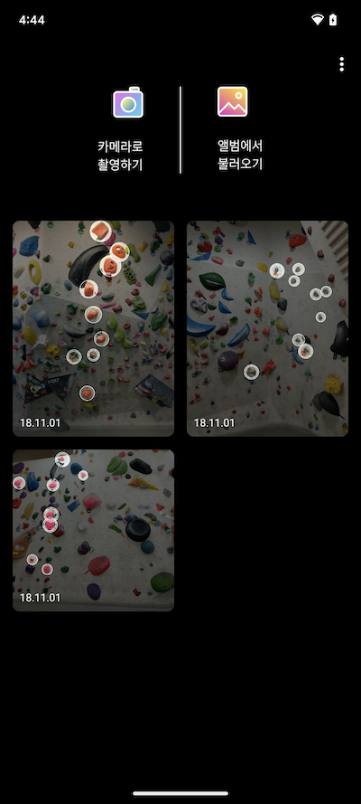
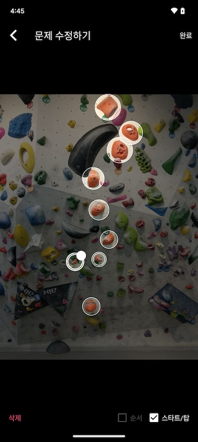

# Android 포트폴리오 프로젝트 Bouldering
[Mobile Application Developer 박정실 - JEONGSIL BAK](https://crust87.notion.site/JEONGSIL-BAK-83b39be2123d49efb4db7495015e15ce)
## 소개
클라이밍 실력 향상을 위해, 볼더링 문제를 사진으로 저장하고 공유하세요. 
1. 암벽 사진을 업로드해보세요.
   - 암벽을 카메라로 바로 촬영하거나, 이미 촬영한 사진을 갤러리에서 불러오세요.
   - 각 볼더링 문제에 원하는 제목을 설정할 수 있어요.
2. 불러온 암벽 사진에 홀드를 터치하여 볼더링 문제를 표시해보세요.
   - 볼더링 난이도나 취향에 따라 표시 색상을 변경할 수 있어요.
   - 문제의 시작과 끝은 별도로 표시하고, 홀드의 순서를 표시할 수 있답니다.
   - 내가 푼 문제는 완료 표시를 하여 성취감을 느껴보세요!
3. 클라이밍을 함께 하는 친구들에게 이 문제를 공유해보세요.
   - '공유하기'를 통해 카카오톡 등으로 볼더링 문제를 공유할 수 있어요.

## Screenshot

## 사용 기술
- Kotlin-MVVM
- Canvas
- Hilt
- Navigation Component
- Room
- Kotlin Coroutine
- Moshi
- Glide

## Update
### 2023-09-18
- README.md 추가
- Editor 코드 개선
- Room 추가 및 Gson -> Moshi 마이그레이션
### 2023-08-03
- 라이브러리 최신화
- Main, Viewer 코드 개선
- 이미지 저장 로직 11 업데이트 대응
## TODO
- 테스트 코드 정상화 및 추가 테스트 작성
- Android Jetpack Compose 버전
- React Native 버전